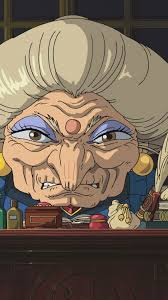
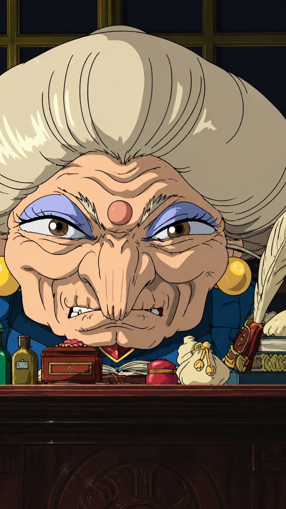

# 🖼️ Pixel Perfect Prompt — AI Image Quality Enhancer

> **Research-backed prompt engineered for AI image enhancement — upscales quality while preserving maximum content fidelity.**  
> Compatible with **ChatGPT (GPT-4o)**, **Nano Banana**, and **Nano Banana Pro**.

[](https://opensource.org/licenses/MIT)
[](https://chat.openai.com)
[](https://codewords.agemo.ai)

---

## 📸 Before & After

<p align="center">
  
  &nbsp;&nbsp;&nbsp;
  
</p>

<p align="center">
  <sub><strong>Left:</strong> Original (low resolution, compression artifacts) · <strong>Right:</strong> Enhanced (higher resolution, sharper, improved contrast)</sub>
</p>

---

## 📋 What is this?

A carefully researched and engineered prompt that forces AI image generators to **enhance image quality** (resolution, sharpness, noise reduction) while preserving **maximum content fidelity** to the original.

### Key Features

- 🔒 **Preservation-first architecture** — fidelity mandate placed before enhancement instructions (AI processes sequentially)
- 🎨 **Style-agnostic** — works with photos, anime, manga, digital art, illustrations, screenshots
- 🚫 **13+ explicit negative constraints** — blocks common AI modification patterns (style transfer, westernization, detail hallucination)
- ✅ **Self-verification checklist** — forces the model to compare output vs input before generating

---

## ⚠️ Honest Expectations

**AI image generators do NOT truly upscale images.** They *regenerate* the image from scratch, which means:

- **Colors may shift** slightly (e.g., deep purple → lighter purple)
- **Proportions may vary** marginally
- **Fine details may be reinterpreted** rather than preserved
- **Output resolution is model-limited** (~1024px for ChatGPT, varies for Nano Banana)
- **Nano Banana has a ~50% failure rate** — expect to retry multiple times

This prompt minimizes these issues through careful engineering, but cannot eliminate them entirely. **For true pixel-perfect upscaling, use the dedicated pipeline below.**

---

## 🚀 Quick Start

### ChatGPT

1. Open ChatGPT
2. **Attach your image first**
3. Paste the contents of [`prompt.txt`](./prompt.txt)
4. Send
5. If something changed, reply: *"The [element] changed. Fix it to match the original."*

### Nano Banana / Nano Banana Pro

1. Upload your image in the same message
2. Paste the contents of [`prompt.txt`](./prompt.txt)
3. Send
4. Retry if the model doesn't return an image (~50% failure rate on Nano Banana)

> 💡 **Removing the watermark:** Install the [**Peel Banana**](https://chromewebstore.google.com/detail/peel-banana) browser extension to automatically remove the Nano Banana watermark from generated images.

---

## 🔥 Ultimate 4K Pipeline (Recommended for Best Results)

For true 4K, pixel-perfect fidelity, and HDR-like look — use this 3-step pipeline with free tools instead of (or on top of) AI generation:

### Step 1: AI Upscale (4×)

| Setting | Value |
|---------|-------|
| **Tool** | [Upscayl](https://upscayl.org/) (free, Win/Mac/Linux) |
| **Model** | `RealESRGAN_x4plus_anime_6B` (anime/illustration) or `RealESRGAN_x4plus` (photos) |
| **Scale** | 4× |
| **GPU** | Enabled (if NVIDIA/AMD available) |
| **Denoise** | 0 (unless source is noisy) |
| **Output** | PNG (no compression loss) |

### Step 2: Sharpen

| Setting | Value |
|---------|-------|
| **Tool** | [GIMP](https://www.gimp.org/downloads/) (free) or Photoshop |
| **Filter** | Unsharp Mask |
| **Radius** | 1.5 px |
| **Amount** | 70–90% |
| **Threshold** | 0 |

### Step 3: HDR-like Color Pop

| Setting | Value |
|---------|-------|
| **Tool** | GIMP or Photoshop |
| **Curves** | Soft S-curve (lift midtones, lower shadows) |
| **Contrast** | +10 to +20% |
| **Vibrance** | +10 to +15% |
| **Saturation** | 0 (vibrance is more natural) |

### Why This Pipeline Beats AI Generation

| Tool | Sharpness | Fidelity | Anime | Photos | Cost |
|------|-----------|----------|-------|--------|------|
| Waifu2x | Soft | High | OK | Poor | Free |
| Nano Banana | Medium | Color drift | Poor | Medium | Free |
| ChatGPT Plus | Medium | Detail drift | Poor | Medium | $20/mo |
| **Upscayl + Pipeline** | **Ultra crisp** | **Pixel-perfect** | **Built for it** | **Excellent** | **Free** |

---

## 🖼️ Works With Any Image Type

This prompt is designed to be universal. Expected results by image type:

| Image Type | AI Prompt Result | Upscayl Pipeline Result |
|------------|-----------------|------------------------|
| 🎌 **Anime / Manga** | Good (minor color shifts possible) | Excellent (use `anime_6B` model) |
| 📷 **Photos** | Good (may soften or sharpen details) | Excellent (use `x4plus` model) |
| 🎨 **Digital Art** | Good (may reinterpret textures) | Excellent |
| 🖥️ **Screenshots** | Moderate (text may blur) | Very good |
| 🖌️ **Paintings** | Moderate (may add unwanted detail) | Good |

---

## 🧠 Research & Methodology

This prompt was engineered based on research from:

| Source | Key Insight |
|--------|-------------|
| Reddit (r/ChatGPT, r/PromptEngineering, r/animeAI) | "Strict fidelity" phrasing, anti-westernization for anime |
| LearnPrompting.org | Instruction ordering — preservation before enhancement |
| PromptHero & Midjourney Discord | Negative prompting adapted for GPT-4o |
| Hacker News | Compositing workflows, iterative correction |

### 6 Engineering Principles

| # | Principle | Why It Matters |
|---|-----------|---------------|
| 1 | **Preservation mandate first** | AI weights earlier instructions more heavily |
| 2 | **Explicit task scope** | Prevents "creative enhancement" drift |
| 3 | **13+ negative constraints** | Without "DO NOT" lists, ~70% of outputs alter content |
| 4 | **Anti-style-transfer** | Blocks AI bias toward adding realism to illustrations |
| 5 | **Separated technical params** | Resolution, sharpness, noise as distinct categories = precision |
| 6 | **Self-verification checklist** | Model self-compares before generating — reduces hallucination |

---

## 📂 Repo Structure

```
pixel-perfect-prompt/
├── prompt.txt              # The prompt (copy-paste into ChatGPT / Nano Banana)
├── README.md               # This file
└── assets/
    ├── original.jpg        # Before (your source image)
    └── result.png          # After (enhanced result)
```

---

## 📜 License

MIT License — use freely, modify, share.

---

*Built with research. Tested with patience. Powered by prompt engineering.*
